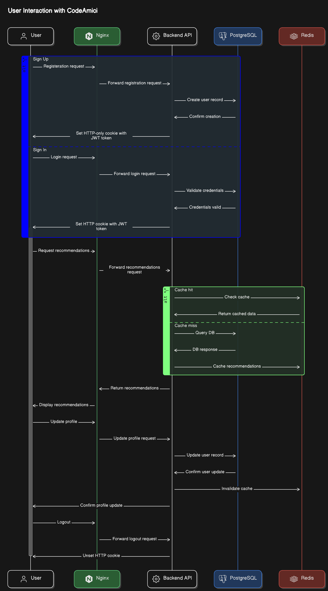

# CodeAmici

CodeAmici is a coding buddy recommendation system designed to connect coders based on their personal preferences and professional skills. The platform leverages a content-based filtering approach to match users with similar interests, goals, and expertise levels. Whether you’re looking to build projects, prepare for coding interviews, or simply learn from each other, CodeAmici provides a personalized experience to help you find the perfect coding partner.

## Tech Stack

- FastAPI: Used for building the backend API due to its high performance.
- SQLAlchemy: The Python SQL toolkit and Object-Relational Mapping (ORM) library for SQL database interactions.
- Pydantic: Used for data validation and settings management, integrated with FastAPI.
- Pandas and Scikit-Learn: Utilized for building the recommendation system.
- PostgreSQL: Chosen as the SQL database for its advanced features and performance.
- Redis: Used for caching recommendations and improving response times.
- React and Redux Toolkit: Used for frontend.
- JWT Token Authentication: Implemented for secure user authentication.
- Docker and Docker Compose: Used for containerizing the application and managing multi-container Docker applications, respectively.

## Prerequisites

Here is what you need to be able to run CodeAmici:

- Docker

## Environment Setup

1. Clone the repository

   ```sh
   https://github.com/ShyamGadde/code-amici.git
   ```

2. Go to the project folder

   ```sh
   cd code-amici
   ```

3. Configure your `.env` file

   - Make a copy of `.env.example` and rename it to `.env` (`mv .env.example .env`)
   - The keys under `# Database` are pre-configured for the Docker setup and should not be changed
   - The keys under `# JWT` can be modified as per your requirements
   - You may change the `SECRET_KEY` by generating a new secret key using `openssl rand -hex 32` and replacing the `SECRET_KEY` value in the `.env` file

4. Run Docker Compose

   ```sh
   docker-compose build --no-cache
   ```

   ```sh
   docker-compose up -d
   ```

5. Populate database with dummy user data

   ```sh
   docker-compose exec backend python utils/seed_db.py
   ```

6. Stopping the Application

   To stop the application and remove the containers, networks, and volumes defined in your docker-compose.yml file, run the following command:

   ```sh
   docker-compose down
   ```

## How to use

1. Once you've successfully run `docker-compose up` and the Docker Compose application is running, open your web browser and navigate to [http://localhost:5000/](http://localhost:5000/).
2. You will be redirected to the login page. Click 'Sign Up' in the top right-hand corner to be redirected to the registration form.
3. Fill in the details as requested in the form.
4. After successful registration, you will be redirected to the recommendations page. Here, you will see your personalized recommendations displayed along with a brief bio, and links to the individual's GitHub and LinkedIn profiles.
5. You may then proceed to check out their GitHub Profile and perhaps even connect on LinkedIn for further communication.

> **NOTE:**  
> These are dummy profiles and hence their LinkedIn and GitHub links don't works.

> **INFO:**  
> You may also use these two test user accounts for signing in.
>
> > Email: testuser1@mail.com  
> > Password: 1234
> >
> > Email: testuser2@mail.com  
> > Password: 1234

## Screenshots

Homepage:


## How it works

### Sequence Diagram



### How the Recommendation System Works

The CodeAmici recommendation system uses a content-based filtering approach to match users with similar interests, goals, and expertise levels. The system takes into account the following user attributes to generate personalized recommendations:

1. **Age and Years of Coding Experience**: The system matches users of similar age and coding experience levels, as they are likely to have comparable learning paces and shared perspectives.
2. **Skills and Expertise Levels**: The system calculates the cosine similarity between the users' lists of programming languages and technologies, along with their respective expertise levels (beginner, intermediate, advanced). This ensures that the recommended coding partners have complementary skills and can learn from each other effectively.
3. **Location**: The system considers the users' locations (country and city) to prioritize matches within the same time zones, facilitating easier coordination and collaboration.
4. **Hobbies and Languages**: The system uses the Jaccard Index to measure the similarity between users' hobbies and common languages. This helps to match users with shared interests and the ability to communicate effectively. Users with no common language are removed from matches.
5. **Goals**: The system matches users with similar goals, such as building projects, preparing for coding interviews, or general skill development. This ensures that the recommended coding partners are aligned in their objectives.
6. **Availability**: The system takes into account the users' weekly availability, measured in hours, to suggest matches that can coordinate their schedules and work together efficiently.

The recommendation process involves the following steps:

1. **Data Preprocessing**: The system collects and preprocesses the user profile data, converting it into a format suitable for the recommendation algorithm.
2. **Similarity Calculation**: The system calculates the similarity between each pair of users based on the attributes mentioned above. For numerical data, such as age, years of coding experience and availability, Euclidean distance is used. For ordinal data like skills and their expertise level, Cosine Similarity is used. And for categorical data, like languages and hobbies, Jaccard Index is employed.
3. **Recommendation Generation**: The system ranks the potential coding partners based on their similarity scores and presents the top recommendations to the user.

### Backend API

CodeAmici’s backend API is built with FastAPI and provides comprehensive documentation for all the API routes, request bodies, and their schemas, as well as response types and their schemas.

You can access the API documentation in two ways:

1. **Swagger UI**: Navigate to [http://localhost:8000/docs](http://localhost:8000/docs) in your web browser. This interactive interface allows you to not only view the details of each API route but also test them out directly from the browser.
2. **Redoc**: Alternatively, you can view the API documentation at [http://localhost:8000/redoc](http://localhost:8000/redoc).

### Authentication and Security

CodeAmici uses JWT (JSON Web Tokens) for secure user authentication. The JWT token is stored in an HTTP-only cookie, providing a layer of security against cross-site scripting (XSS) attacks.

The application is composed of a frontend and a backend, each running in separate Docker containers. An Nginx server is used to serve the frontend files and also acts as a reverse proxy that forwards API calls to the backend. This setup allows the frontend and backend to communicate as if they were on the same domain, avoiding issues with the SameSite attribute of cookies.

Here’s a brief overview of how the authentication process works:

1. **User Authentication**: When a user logs in, the backend validates their credentials. Upon successful validation, the backend generates a JWT token and sends it as a Set-Cookie header in the response.
2. **Storing JWT Token**: The JWT token is stored in an HTTP-only cookie on the client side. This means the token cannot be accessed through client-side scripts, providing protection against XSS attacks.
3. **API Requests**: When the client makes subsequent API requests, the JWT token is automatically included in the Cookie header of the request.
4. **Token Verification**: The backend verifies the JWT token in each request to protected API routes. If the token is valid, the request is processed; otherwise, an error is returned.
5. **Reverse Proxy**: As this is a development environment, this setup does not use HTTP certificates, so the Secure attribute is not set for the cookie, and the SameSite attribute cannot be set to None. The Nginx server acts as a reverse proxy by forwarding API requests from the client to the backend.
6. **CORS Configuration**: The backend uses CORS middleware and includes the Nginx server in its list of allowed origins. This setup allows the frontend and backend to communicate despite being on different origins.

## Acknowledgements

The dummy data for the test database was generated using [Mockaroo](https://mockaroo.com/), a realistic data generator, in combination with some Python scripting.
